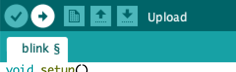

# Exercise 1 - Blink Onboard LED

## Introduction

Internet Of Things, at it's simplest level, is a network of smart devices - from refrigerators that warn you when you're out of milk to industrial sensors - that are connected to the internet so they can exchange data.


In this exercise, we will make a NodeMCU blink it's on-board LED using Arduino IDE.


<br/>

1. First things first, let's connect the NodeMCU via a micro USB cable to your laptop.
2. Now, open up your Arduino IDE, you should see some template code already present to get you started. Arduino uses a modified version of the C++ programming language to make it easier to program micro-controllers. To put it short, it's a domain specific language for programming micro-controllers.
```c++
void setup() {
  // put your setup code here, to run once:

}

void loop() {
  // put your main code here, to run repeatedly:

}
```
3. Two functions are defined in the template code, `setup()` and `loop()`.
4. The `setup()` function allows us to initialize our code, this could mean that you can do things like configuring your application, setting up a local database connection etc as soon as the code starts running.
5. The `loop()` function runs repeatedly throughout the life of the program. Usually most of the functionality is programmed in this method. This type of structure is best suited for most IoT usecases where the device is expected to be in constant contact with servers, exchanging data and listening for commands to accomodate for real world situations like sensing a sudden change in the temperature of the room and sending an alert to your device about the same and then also taking appropriate steps to get stabilize the temperature.
6. Now that we have a basic understanding of how an Arduino program works, let's get started with our blinking project!
7. Most boards have a built-in LED light that can be accessed in Arduino IDE by using the constant `LED_BUILTIN`.
8. Let's start by adding the following code to the `setup()` function.
```c++
void setup() {
  pinMode(LED_BUILTIN, OUTPUT);
}
```
9. This code will initialize the LED_BUILTIN pin as the output.
10. Now that we have explicitly defined our output pin, let's use this pin to blink our LED.
11. Now replace the `loop()` function with the following code:
```c++
// the loop function runs over and over again forever
void loop()
{
  digitalWrite(LED_BUILTIN, LOW); // Turn the LED on (Note that LOW is the voltage level
  // but actually the LED is on; this is because
  // it is active low on the ESP-01)
  delay(1000);                     // Wait for a second
  digitalWrite(LED_BUILTIN, HIGH); // Turn the LED off by making the voltage HIGH
  delay(2000);                     // Wait for two seconds (to demonstrate the active low LED)
}
```
12. The `digitalWrite` method is used to write a `HIGH` or a `LOW` voltage to a digital pin. If the pin has been configured as an OUTPUT with pinMode(), its voltage will be set to the corresponding value: 5V (or 3.3V on 3.3V boards) for HIGH, 0V (ground) for LOW. 
13. If you do not set the pinMode() to OUTPUT, and connect an LED to a pin, when calling digitalWrite(HIGH), the LED may appear dim.
14. The above code allows us to control the amount of power being supplied to the LED pin, therefore turning the LED on and off. Doing  this on a repeated basis allows us to create an effect of blinking.
15. The `delay` function allows us to yield the sketch for `n` number of milliseconds before it continues executing the rest of the code. This allows us to control how frequently the LED should blink.
16. Now all you have to do is click the `Verify` button as show below to make sure that everything is working fine.

17. The last step, to see the fruits of our labour, is to upload the code onto our device. Use the `Upload` button right next to the `Verify` button to start uploading the code to your NodeMCU.

18. If everything goes well, you should be able to see the LED on your board start blinking!
29. Congratulations on writing your first Arduino code!!!

 